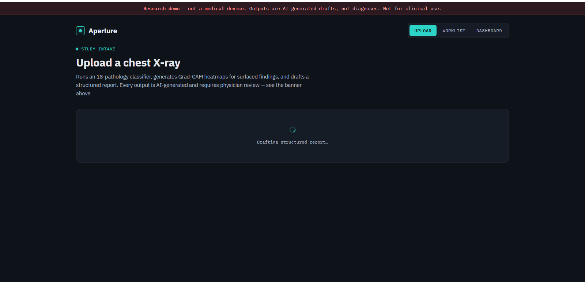
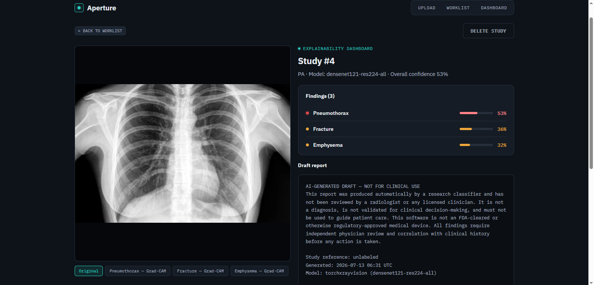
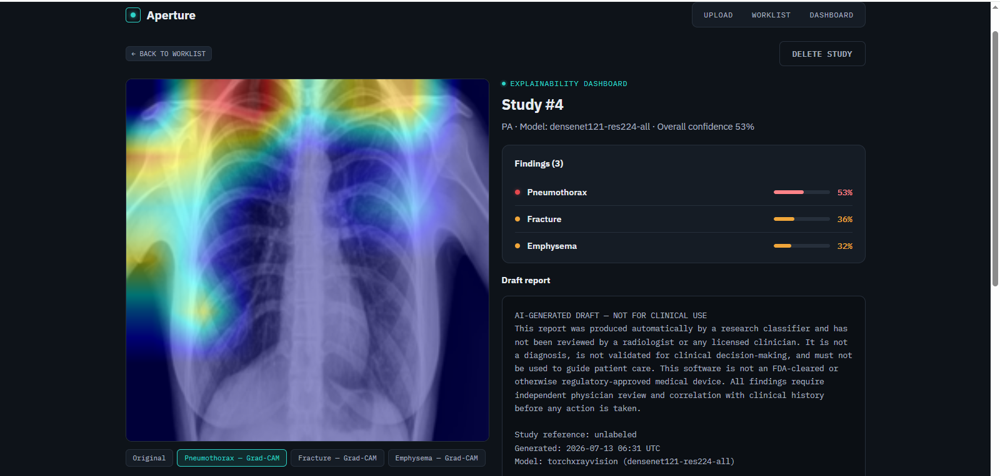
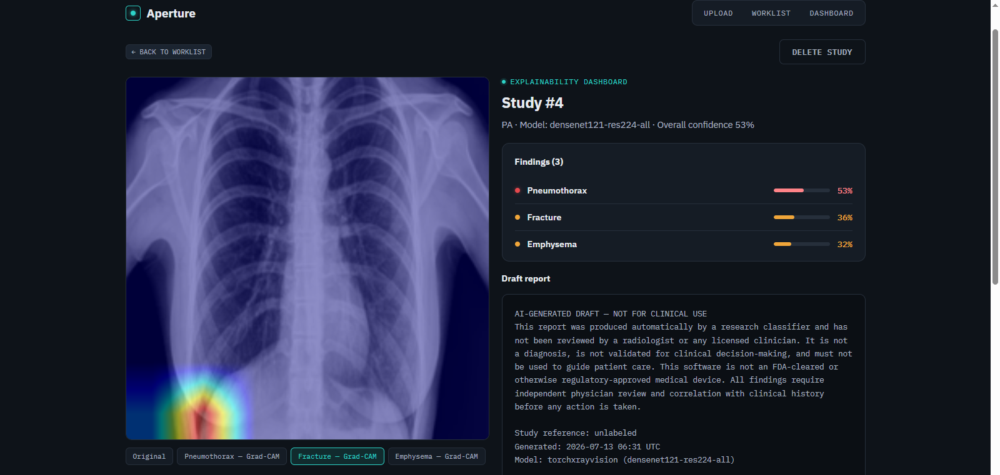
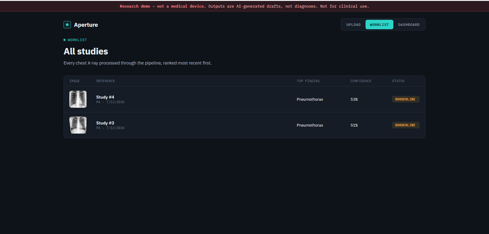
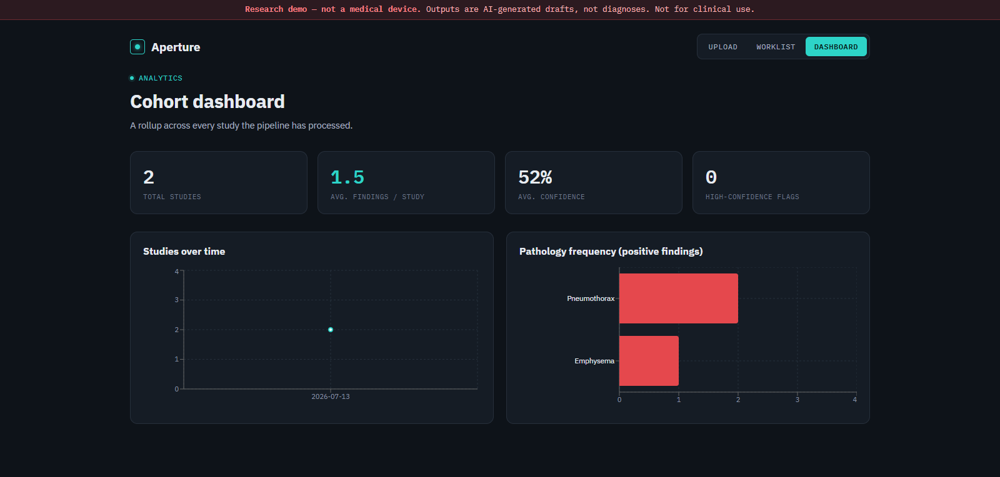

# Aperture — Chest X-ray AI Assistant

A research/educational demo of the kind of pipeline behind clinical-decision-support
-> upload a chest X-ray, get pathology probabilities across
18 findings, Grad-CAM heatmaps showing what the model looked at, and a
structured draft report.

## ⚠️ Read this before you use it for anything

**This is not a medical device and must not be used for real clinical
diagnosis, screening, or patient care.** It is not FDA-cleared, not CE-marked,
not validated against any clinical gold standard, and was not built or tested
under a quality management system. Concretely:

- The underlying model (`torchxrayvision`, `densenet121-res224-all`) is a
  published open-source research model trained on public datasets (NIH
  ChestX-ray14, CheXpert, MIMIC-CXR, PadChest). Those datasets have well-known
  label noise (many labels were extracted from radiology report text with NLP,
  not verified by a radiologist per-image) and demographic/equipment biases.
  Real diagnostic products go through far more rigorous, clinically-validated
  training and evaluation than this.
- `FINDING_THRESHOLD=0.5` and `BORDERLINE_THRESHOLD=0.3` (in `config.py`) are
  arbitrary defaults, not clinically calibrated cutoffs. Sensitivity/specificity
  at these thresholds have not been measured against ground truth.
- The draft report is template-generated from the model's own probabilities —
  it cannot know about anything the model didn't detect, but it also cannot
  catch anything the model missed. A false negative here looks exactly like
  "no findings."
- Every report and every page in the UI carries the same disclaimer for a
  reason: **treat every output as a starting point for a licensed
  radiologist, never as an answer.**

This project exists to demonstrate the engineering pattern (classification →
explainability → structured reporting → analytics), not to make clinical
claims.

---

---
---

---
---

---
---

---
---

---
---

---

## What it actually does

| Feature | Model / technique | Notes |
|---|---|---|
| Pathology classification (18 findings) | `torchxrayvision` pretrained DenseNet121 | Real inference against a real published model — not a stub or random output. |
| Draft radiology report | Template built from the model's own probabilities | Every sentence traces to a specific model output; nothing is free-form generated by an LLM, to avoid the report inventing findings the classifier didn't produce. |
| Grad-CAM explainability | Hook-based Grad-CAM on the model's final conv block | Shows which image regions drove each flagged finding. |
| Confidence scoring | Raw sigmoid outputs from the classifier | Shown per-finding and as an overall study confidence (max across findings). |
| Explainability dashboard | Next.js viewer with per-pathology heatmap toggle | Switch between the original image and any finding's Grad-CAM overlay. |
| Cohort dashboard | Aggregation over stored studies | Pathology frequency, average findings/study, studies over time. |
| DICOM support | `pydicom` | Reads `.dcm` pixel data (with rescale slope/intercept applied), alongside plain JPEG/PNG. |

## Stack

- **Backend**: FastAPI, SQLAlchemy, PostgreSQL (SQLite fallback for local dev)
- **ML**: PyTorch, `torchxrayvision`, OpenCV (Grad-CAM overlay), `pydicom`
- **Frontend**: Next.js (App Router), Recharts
- **Infra**: Docker Compose (Postgres + backend + frontend)

## Before you run it

The classifier downloads its pretrained weights (a few hundred MB) the first
time it's used, cached under `~/.torchxrayvision` afterwards. That means:

- **You need an internet connection** on first use.
- **The first upload will be slow** — expect anywhere from 30 seconds to a
  few minutes depending on your connection and whether you're on CPU or GPU.
  Subsequent uploads are much faster (weights stay cached on disk, model
  stays loaded in memory for the life of the process).
- **CPU inference works but is slow**, especially Grad-CAM (each flagged
  finding needs its own backward pass). A CUDA GPU (`FORCE_CPU=false`,
  default) speeds this up substantially.
- I built and syntax/wiring-tested this in a sandboxed environment without
  general internet access, so I could not download the real `torchxrayvision`
  weights or run a genuine end-to-end inference pass before handing it to
  you. What I did verify: the FastAPI routing, database layer, and pipeline
  orchestration (tested with the real request/response cycle against mocked
  model internals). The preprocessing steps in `preprocessing.py` follow
  `torchxrayvision`'s documented normalization pipeline
  (`xrv.datasets.normalize` → `XRayCenterCrop` → `XRayResizer` →
  model-ready tensor) and the Grad-CAM hook in `gradcam.py` targets
  `model.features`, the standard DenseNet121 final-conv-block target — but
  library APIs do shift between versions, so **do a real smoke test on your
  machine** and expect to debug a minor mismatch (e.g. a renamed argument) as
  normal for a project this size, not evidence the whole thing is broken.

## Quick start (Docker — recommended)

```bash
docker compose up --build
```

- Frontend: http://localhost:3000
- Backend API docs: http://localhost:8000/docs
- Postgres persists in a named volume; model weights persist in another so
  you don't re-download them on every container rebuild.

## Quick start (local, no Docker)

```bash
./run.sh        # macOS/Linux
run.bat         # Windows
```

Creates a Python venv, installs both sides' dependencies, and starts both.
Uses SQLite by default.

## Manual setup

```bash
# Backend
cd backend
python3 -m venv .venv && source .venv/bin/activate
pip install -r requirements.txt
uvicorn app.main:app --reload

# Frontend (separate terminal)
cd frontend
npm install
npm run dev
```

## API overview

| Endpoint | Method | Purpose |
|---|---|---|
| `/api/studies/upload` | POST | Upload a chest X-ray (`.dcm`/`.jpg`/`.png`), run the full pipeline, store the result |
| `/api/studies` | GET | List studies |
| `/api/studies/{id}` | GET | Full analysis for one study |
| `/api/studies/{id}` | DELETE | Remove a study |
| `/api/dashboard/stats` | GET | Cohort-level analytics |
| `/api/health` | GET | Service + device check, includes the standing disclaimer |

Full interactive docs at `/docs` once the backend is running.

## Project structure

```
backend/
  app/
    main.py                 FastAPI app, CORS, static mounts
    config.py                Settings incl. finding/borderline thresholds
    database.py               SQLAlchemy engine/session
    models.py                  Study table
    schemas.py                 Pydantic response models
    routers/
      studies.py              Upload / list / get / delete
      dashboard.py             Cohort analytics
    services/
      model_registry.py       Lazy-loaded singleton classifier
      preprocessing.py         DICOM/JPEG/PNG loading + xrv normalization
      inference.py              Runs the classifier, splits pos/borderline findings
      gradcam.py                 Hook-based Grad-CAM + heatmap overlay
      report_generator.py        Template-based draft report + disclaimer
      pipeline.py                 Orchestrates all of the above per upload
frontend/
  app/
    page.js                  Upload
    worklist/page.js          Study list
    study/[id]/page.js         Explainability dashboard (viewer + findings + report)
    dashboard/page.js           Cohort analytics
  lib/api.js                 Fetch wrapper for the backend
docker-compose.yml            Postgres + backend + frontend
run.sh / run.bat              Local dev launchers (no Docker)
```

## Known limitations / honest caveats

- **No ground-truth validation was performed on your data.** Accuracy figures
  for `torchxrayvision`'s public benchmarks don't necessarily transfer to
  images from a different scanner, population, or acquisition protocol.
- **Grad-CAM shows correlation, not causation** — it highlights regions that
  influenced the model's score, which is not the same as clinically
  confirming pathology is present there.
- **The 18-pathology label set is fixed** by the pretrained model; anything
  outside that set (e.g. rib fractures the model wasn't trained to flag with
  confidence, foreign bodies, tubes/lines) will not be reliably detected even
  though "Fracture" is nominally one of the 18 labels — real-world
  performance on rarer classes tends to be weaker than on common ones like
  Cardiomegaly or Effusion.
- **No auth/multi-tenancy** — single-cohort as built. Add an auth layer
  before exposing any real patient data, and note that doing so would also
  require full HIPAA/equivalent compliance work this project does not
  attempt to provide.
